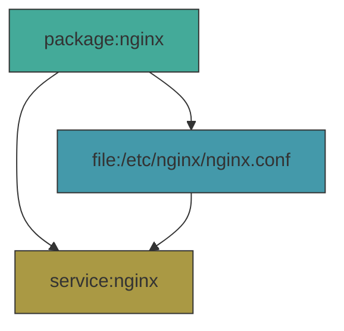
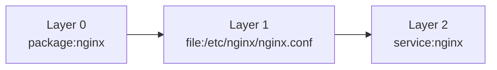
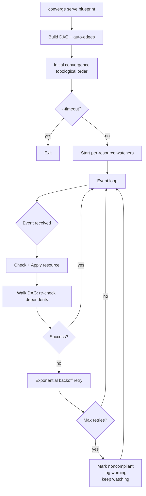
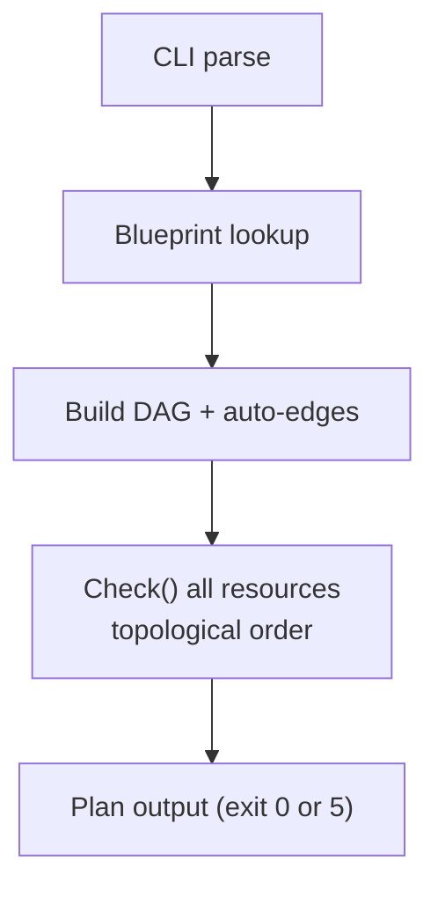

# Design

Converge is a Go-based configuration management daemon that compiles to a single static binary per platform. It uses a DAG engine with event-driven drift detection to maintain desired state on endpoints. This document covers the motivation, design philosophy, and internal architecture.

---

## Why Converge

### The DAG + Event-Driven Difference

Every mainstream configuration management tool runs on a timer: Chef every 30 minutes, Puppet every 30 minutes, Ansible only when you push. Between runs, drift is invisible. When a run does happen, the tool re-checks everything, whether it changed or not.

Converge inverts this model:

| Capability | Converge | Chef/Puppet | Ansible | Terraform |
|---|---|---|---|---|
| Drift detection latency | <1s (OS events) | ~30 min (cron) | None (push-only) | N/A (infra) |
| What gets re-checked on drift | Drifted resource + DAG dependents | Everything | Everything | N/A |
| Dependency-aware re-convergence | Yes (DAG propagation) | No (run-list order) | No (playbook order) | Yes (infra only) |
| Runtime deps | None | Ruby | Python | None |
| Scope | Endpoint config | Endpoint config | Endpoint config | Cloud infra |

When someone manually edits `/etc/nginx/nginx.conf`, converge detects the change via inotify within milliseconds, re-checks the file, restores it, and then walks the DAG to re-check `service:nginx` (because it depends on that file). Chef and Puppet would not notice until the next cron run, and even then they would re-check every resource in the catalog, not just the affected subgraph.

This is not an incremental improvement. It is a fundamentally different architecture.

### The Runtime Dependency Problem

We manage 500K+ endpoints across macOS, Windows, and Linux. Every mainstream tool drags an interpreted language runtime onto every endpoint:

| Tool | Runtime Required | Language | State Model |
|-----------|-----------------|----------|-------------|
| Chef/Cinc | Ruby + gem deps | Ruby DSL | Converge-on-run (server or zero-agent) |
| Puppet | Ruby (agent); JVM/JRuby (Puppet Server) | Puppet DSL | Catalog compiled locally (`puppet apply`) or on server (agent mode) |
| Ansible | Python 2/3 | YAML + Jinja2 | Push-based; `ansible-pull` enables cron/pull but is not the standard model |
| Terraform | None (binary) | HCL | State file (remote or local) |
| Salt | Python | YAML + Jinja2 | Converge-on-run or push |

The problems compound at scale:

- **Runtime dependencies are a liability.** Chef needs Ruby. Ansible needs Python. Puppet needs a JVM. At 500K endpoints, every runtime is an attack surface, a version-skew headache, and a bootstrap chicken-and-egg problem.
- **Interpreted languages lack compile-time safety.** A typo in a Chef recipe, a wrong Jinja2 variable type in Ansible: none fail until runtime, on a production endpoint, possibly at 2 AM.
- **YAML-based tools are stringly-typed.** Ansible playbooks and Salt states are YAML with string interpolation. No IDE autocompletion, no refactoring support, no type checking.
- **Terraform solves the wrong problem.** Excellent for provisioning infrastructure but wrong for endpoint configuration management. It requires state files and has no concept of converging local system state.
- **Cross-tool drift.** When Chef manages the same file in two cookbooks, the last recipe to run wins. No conflict detection.
- **Cron-based convergence is blind between runs.** A 30-minute cron interval means up to 30 minutes of undetected drift. Converge's event-driven daemon detects drift in milliseconds via OS-native events.

---

## Solution

One `converge` binary per OS/arch. No Ruby, no Python, no JVM, no gem install, no pip, no apt. The binary IS the tool.

### Core Properties

| Property | Detail |
|----------|--------|
| Event-driven DAG daemon | OS-level watchers (inotify, dbus, registry notifications) detect drift in <1s. DAG propagation re-checks dependents automatically. |
| Single binary, zero deps | Static binary per platform. Drop on a fresh image and run. |
| Blueprints are Go packages | Static types, compile-time errors, `go test`, IDE autocompletion. |
| Convergent, no state file | Every resource checks live system state on every run. No state file to corrupt. |
| Cross-platform from one codebase | Go build tags handle platform-specific implementations. |

---

## Design Philosophy

### DAG-Native > Run-List

Chef executes a flat run-list. Puppet compiles a catalog with ordering hints. Both re-process everything on every run. Converge builds a true DAG where dependencies are first-class: when one resource drifts, only its subgraph is re-evaluated.

### Event-Driven > Cron

Cron-based tools poll the entire catalog every N minutes. Between runs, drift is invisible. Converge uses OS-native event mechanisms (inotify for files on Linux, dbus for services, registry change notifications on Windows) to detect drift the instant it happens. The daemon idles at near-zero CPU until an event fires.

### Compiled > Interpreted

If it compiles, the resource definitions are structurally valid. The compiler catches misspelled resource names, wrong parameter types, missing required parameters, unused imports, and interface contract violations.

### Type-Safe > Stringly-Typed

Every resource parameter has a concrete Go type. `Mode` is `os.FileMode`, not a string. `Enabled` is `bool`, not `"true"`. The type system prevents an entire class of bugs that YAML-based tools silently accept.

### Simple > Clever

The target is 10-year maintainability:

- No custom DSL. It's Go.
- No inheritance hierarchies. Blueprints compose via function calls.
- No implicit mutations. Auto-edges affect execution order, not what resources exist.
- No magic variables. Parameters are explicit function arguments.

### One Way to Do Things

One error handling pattern (the `Critical` flag). One way to include shared logic (`Include()`). One way to template files. Consistency at 500K endpoints matters more than flexibility.

---

## Security Model

| Mode | Privilege | Network | Mutations |
|---------|-----------------|---------|-----------|
| `plan` | Unprivileged | None | None (read-only `Check()` calls) |
| `serve` | root / SYSTEM | None | Applies changes where `Check()` reports drift, watches for further drift |

- **No network by default.** Zero network calls during execution. All configuration is compiled in or read from local disk.
- **No secrets in code.** Secrets come from AES-256-GCM encrypted config values via `r.Secret()`. Encrypted values use the `ENC[AES256:...]` format and are decrypted at runtime with a high-entropy key provided via `SetConfigKey()`, compiled into the binary at build time. No external key files, no environment variables. Decryption is fail-closed: missing keys or corrupted ciphertext return empty strings, never raw ciphertext.

---

## Convergent Model

The fundamental abstraction is the **resource**, implementing two methods (simplified from the actual `Extension` interface in `extensions/extension.go`):

```go
type Extension interface {
    Check(ctx context.Context) (*State, error)
    Apply(ctx context.Context) (*Result, error)
}
```

`Check` returns `*State{InSync: true}` when nothing needs to change, or `*State{InSync: false, Changes: [...]}` with specific property changes. See [`extensions/state.go`](../extensions/state.go).

`Check()` is read-only. `Apply()` mutates the system and is only called when `Check()` reports `InSync: false`. A follow-up `Check()` must return `InSync: true`, otherwise Converge reports a convergence failure.

**Idempotency by construction:** Run it once, drift is fixed. Run it again, nothing changes. The engine enforces this via the Check/Apply split.

---

## Architecture

### Package Layout

| Package | Description |
|---------|-------------|
| `dsl/` | Public SDK: blueprint types, opts structs, resource methods, shard/config helpers |
| `extensions/` | Resource implementations: one subdirectory per resource type, see directory for full list |
| `internal/` | Engine, DAG graph, daemon, auto-edges, exit codes, platform detection, output, logging |
| `cmd/converge/` | Cobra CLI entry point, blueprint registration |
| `blueprints/` | Built-in blueprints: baseline, linux, darwin, windows, CIS L1 |

**Boundary rules:**

| Package | Importable by | Stability |
|---------|--------------|-----------|
| `dsl/` | Anyone (blueprint authors) | Public API, semver-guarded |
| `extensions/*` | Anyone (community contributors) | Public, add new extensions via PR |
| `internal/*` | Only this module | Free to change without notice |
| `cmd/converge/` | Nobody (main) | CLI contract only |

### Extension Interface

Every resource type implements:

```go
type Extension interface {
    ID() string
    Check(ctx context.Context) (*State, error)
    Apply(ctx context.Context) (*Result, error)
    String() string
}
```

- **ID()**: unique identifier (e.g. `file:/etc/motd`, `package:git`). Used for duplicate detection.
- **Check()**: reads current state, returns whether in sync. No root required.
- **Apply()**: mutates the system. Requires root. Only called when Check() reports out-of-sync.
- **String()**: human-readable label for output (e.g. `File /etc/motd`).

Extensions may optionally implement:

```go
type Watcher interface {
    Watch(ctx context.Context, events chan<- Event) error
}

type Poller interface {
    PollInterval() time.Duration
}
```

- **Watcher**: blocks on OS-level events (inotify, dbus, etc.) and sends events when the resource may have drifted. Used by daemon mode for instant drift detection.
- **Poller**: overrides the default poll interval for resources without native OS event support.

### Platform-Specific Code

Platform-specific code uses Go build tags. There are no stubs or no-op shims: if a platform doesn't need an extension, the DSL simply doesn't expose it.

**Extension pattern:** shared struct in a plain `.go` file (no build tag), `Check()`/`Apply()` in build-tagged files (one per platform). Example: `extensions/service/service.go` + `service_linux.go` + `service_windows.go`.

**DSL pattern:** cross-platform methods in `dsl/run.go`, platform-specific methods in `dsl/run_<platform>.go`, factories in `dsl/resources.go` and `dsl/resources_<platform>.go`.

This means a Linux blueprint can call `r.Sysctl()` but not `r.Registry()`. The compiler enforces platform correctness, no runtime "skipped (not Windows)" messages.

### DAG Engine

Resources are organized in a directed acyclic graph (DAG). Dependencies are detected automatically via auto-edges and can be declared explicitly via `condition.Package("name")` on the resource's `Condition` field. The engine computes topological layers and executes them in order, with resources in the same layer running concurrently.



**Topological layers:** Layer 0 (no deps) runs first, layer N runs after all layers < N complete. Within a layer, resources run concurrently up to `--parallel`.



**DAG-aware re-convergence:** When a resource drifts in daemon mode, the engine does not re-check the entire catalog. It re-checks the drifted resource, and if that resource changed, it walks the DAG forward to re-check all dependents. In the example above, if `file:/etc/nginx/nginx.conf` is modified externally, converge detects it via inotify, restores the file, then automatically re-checks `service:nginx` (because the service depends on the config file). Chef and Puppet have no equivalent: they re-run the entire catalog on the next cron tick.

### Auto-Edges

Implicit dependencies are detected automatically:

| From | To | Detection |
|---|---|---|
| `service:X` | `package:X` | Name equality |
| `file:/a/b/c` | `file:/a/b` | Parent path match |
| `service:X` | `file:*X*` | File path contains service name |

Auto-edges that would create cycles are silently skipped.

### Event-Driven Daemon (`converge serve`)

The daemon architecture is fundamentally different from cron-based tools. Instead of re-processing the entire catalog on a timer, converge uses OS-native event mechanisms to detect drift the instant it happens:

| Resource Type | Event Mechanism | Platform |
|---|---|---|
| File | inotify | Linux |
| File | kqueue | macOS |
| File | ReadDirectoryChangesW | Windows |
| Service | dbus signals | Linux |
| Service | SCM notifications | Windows |
| Registry | RegNotifyChangeKeyValue | Windows |
| Package, Exec | Polling fallback | All |

When no events are firing, the daemon idles at near-zero CPU. There is no 30-minute polling loop burning cycles to discover nothing changed.



**Key behaviors:**

- **Condition gates.** Resources with a `Condition` set are skipped until the condition is met. The daemon waits using OS-native events (netlink, inotify, NotifyIpInterfaceChange, RegNotifyChangeKeyValue) and triggers initial convergence the moment the condition becomes true. See the `condition` package.
- **Event-driven, not polling.** Resources implementing `Watcher` (File via inotify, Service via dbus) block on OS-level events. Near-zero CPU at idle.
- **DAG propagation.** When a resource changes, its downstream dependents in the DAG are automatically re-checked. This is what Chef, Puppet, and Ansible lack entirely.
- **Polling fallback.** Resources without native OS events (Package, Exec) are polled at configurable intervals.
- **Event coalescing.** Multiple rapid events for the same resource collapse into one CheckApply (500ms window).
- **Rate limiting.** Per-resource rate limiter prevents flapping resources from consuming CPU.
- **Exponential retry.** On failure: `baseDelay * 2^retryCount` (capped at 5 minutes). After `--max-retries` (default 3), resource is marked noncompliant.
- **Noncompliance reset.** New external Watch events reset the retry counter, giving the resource another chance.

### Plan Flow



### Exit Codes

Defined in `internal/exit/exit.go`:

| Code | Name | Meaning |
|---|---|---|
| 0 | OK | All resources in sync |
| 1 | Error | General error |
| 2 | Changed | One or more resources changed |
| 3 | PartialFail | Some resources failed |
| 4 | AllFailed | All resources failed |
| 5 | Pending | Plan mode: changes pending |
| 10 | NotRoot | Requires root/administrator |
| 11 | NotFound | Blueprint not found |

**Key behaviors:**

- **DAG execution order.** Resources execute in topological layer order. Dependencies complete before dependents.
- **Auto-edges.** Implicit dependencies detected automatically (Service->Package, File->parent Dir).
- **Duplicate detection.** Two extensions with same `ID()` = error before any Check().
- **Critical flag.** If `Critical: true` (default: false), failure aborts remaining apply.
- **Parallel execution.** `--parallel N` runs up to N resources concurrently within each layer (default: sequential).
- **Per-resource timeout.** `--timeout` sets the deadline for each resource's Check/Apply cycle.
- **Detailed exit codes.** `--detailed-exit-codes` enables granular exit codes for CI/CD integration.

### Platform Abstraction

`internal/platform.Detect()` returns:

```go
type Info struct {
    OS         string // "linux", "darwin", "windows"
    Distro     string // "ubuntu", "fedora", "macos", "windows"
    PkgManager string // "apt", "dnf", "yum", "zypper", "apk", "pacman", "brew", "choco", "winget", ""
    InitSystem string // "systemd", "launchd", "windows", ""
    Arch       string // "amd64", "arm64"
}
```

### Output Architecture

All CLI output goes through a `Printer` interface with three implementations:

| Format | Notes |
|--------|-------|
| **terminal** | ANSI color, Unicode symbols, animated spinner, progress counter `[3/6]`. Default. |
| **serial** | ASCII-only, no escape codes, no spinner. For serial consoles, GCP, CI logs. |
| **json** | Full change details per resource. Machine-readable. |

### Demo GIF

`assets/vhs-demo.go` renders representative plan output for the README demo GIF. See [assets/README.md](https://github.com/TsekNet/converge/blob/main/assets/README.md) for prerequisites and setup. Regenerate:

```bash
vhs assets/demo.tape
```

### Logging

Uses [google/deck](https://github.com/google/deck) for structured logging:

- **Linux**: syslog (`journalctl -t converge`)
- **Windows**: Windows Event Log (Event Viewer > Application)
- **stderr**: only with `--verbose` flag

---

## Native OS APIs

Converge avoids shelling out to executables wherever a native API exists. This eliminates parsing fragile command output, avoids PATH/locale issues, and makes Check() truly read-only (no accidental side effects from exec).

| Resource | Platform | API | What it replaces |
|----------|----------|-----|-----------------|
| Registry | Windows | `golang.org/x/sys/windows/registry` | `reg.exe` |
| Service | Windows | `golang.org/x/sys/windows/svc/mgr` | `sc.exe` |
| SecurityPolicy | Windows | `netapi32.dll` `NetUserModalsGet/Set` | `secedit.exe` |
| AuditPolicy | Windows | `advapi32.dll` `AuditQuerySystemPolicy/AuditSetSystemPolicy` | `auditpol.exe` |
| Sysctl | Linux | Direct `/proc/sys/` file I/O | `sysctl` command |
| Plist | macOS | `howett.net/plist` (binary plist encode/decode) | `defaults` command |
| Firewall | Linux | `github.com/google/nftables` netlink (IPv4 only) | `iptables` / `nft` commands |
| Firewall | Windows | `go-ole` COM API (INetFwPolicy2 / INetFwRules) | `netsh advfirewall` |
| Shard (serial) | Linux | `/sys/class/dmi/id/product_serial` file I/O | `dmidecode` command |
| Shard (serial) | Windows | `HKLM\HARDWARE\...\BIOS\SerialNumber` registry | `wmic bios` command |
| Shard (serial) | macOS | `/usr/sbin/sysctl -n kern.uuid` (hardware UUID) | `ioreg` command |

---

## Lessons from Chef

These are real bugs, outages, and hours lost managing endpoints with Chef at scale.

| Problem | Chef | Converge |
|---------|------|----------|
| 30-minute blind spots | Cron runs every 30 min, drift invisible between runs | Event-driven daemon detects drift in <1s |
| No dependency propagation | Re-runs entire catalog, unaware which resources are affected | DAG walks forward from drifted resource, re-checks only dependents |
| Cross-cookbook file conflicts | Last recipe wins, no warning | Duplicate resource declarations are build errors |
| Type coercion | `"0"` is truthy in Ruby | `bool` is `bool`, compiler enforces types |
| Regex file mutations | `Chef::Util::FileEdit` with fragile regexes | Declarative file content, atomic writes |
| Inconsistent error handling | Default failure behavior varies by provider (raise vs. warn vs. silent return); `ignore_failure` is available on every resource but requires opting in explicitly | `Critical` flag on every resource; failure behavior is uniform by default |
| Monolithic recipes | `include_recipe` and custom resource partials exist but are separate concepts with separate lookup paths; LWRP boilerplate raises the cost of decomposition | `Include()` is a plain Go function call; no boilerplate, no separate file lookup |
| No real unit testing | ChefSpec tests the compiled resource collection, not converged system state (that is InSpec's role); Test Kitchen integration tests take long to run | `go test` with mock Run, subsecond feedback |

---

## Scope

Converge manages everything on the endpoint: packages, services, files, users, firewall rules, registry keys, kernel parameters, audit policies. With `converge serve`, it continuously enforces desired state via event-driven drift detection and DAG-aware re-convergence.

What converge does **not** do:

- **Cloud infrastructure.** VMs, VPCs, load balancers, DNS records: use Terraform. Converge operates *on* the endpoint, not *above* it.
- **Fleet-wide orchestration.** No rolling deploys, blue-green, or traffic shifting across hosts. Converge manages per-host state. Use `r.InShard()` for percentage-based canary rollouts within a fleet.
- **Dashboards and alerting.** `converge serve` detects and fixes drift in real-time, but doesn't provide observability UI. Pair with Fleet/osquery/Prometheus.
- **Package hosting.** It installs packages but doesn't host them.

---

## Immutable Infrastructure and Converge

Immutable infrastructure (NixOS, OSTree, image-based macOS MDM, golden VM images built with Packer) is a legitimate and increasingly popular approach: bake configuration into the image, redeploy rather than mutate. For servers and containers this model works well.

Converge is complementary to immutable images, not a replacement for them. The same blueprint runs in both phases:

1. **Image build (Packer, cloud-init, OS deployment):** Run `converge serve --timeout 30s` as a provisioner step. Converge applies the full blueprint once and exits when the system is stable. The hardened, configured state is baked into the image.
2. **Running system:** The same binary runs as a daemon. Any drift from the baked state, whether from a user change, an in-place OS update reverting a setting, or a sysadmin editing a file directly, is detected and corrected in under a second.

One blueprint, two modes, zero duplication between image build and runtime enforcement.

Endpoints are not servers:

| Constraint | Servers/Containers | Endpoints (macOS, Windows, Linux workstations) |
|---|---|---|
| Can redeploy to fix drift | Yes: replace the container or VM | Rarely: reimaging disrupts the user |
| User-installed software | No: image is immutable | Yes: users install things; drift is expected |
| Hardware-tied state | No | Yes: local certificates, TPM-bound keys, per-device enrollment |
| OS update model | Replace image | In-place upgrade (Windows Update, macOS, apt) |
| Persona/profile | Stateless | Stateful: home dir, preferences, enrolled identities |

Even with an immutable OS base, endpoints accumulate mutable state after first boot. Converge detects and corrects that drift without requiring a reimaging cycle.

---

## MDM and Converge

MDM platforms (Apple DDM, Intune, Fleet) use a server-push model: a cloud server owns the desired state, delivers profiles and policies to devices via push notifications (APNs, WNS), and devices check in periodically to report compliance.

Converge is a local daemon with no server dependency. Desired state lives in compiled blueprints on the device itself. Drift detection uses OS kernel events, not server check-ins.

| | Converge | MDM (DDM / Intune / Fleet) |
|---|---|---|
| State authority | Local blueprint on device | Cloud MDM server |
| Drift trigger | OS kernel events (ms latency) | Server push + device check-in (s to min latency) |
| Re-convergence scope | DAG subgraph (affected resource + dependents) | Entire profile or policy |
| Server required | No | Yes |
| Scope | Packages, files, services, firewall, registry, sysctl | Profiles, policies, apps, compliance, enrollment |
| Enforcement model | Continuous local daemon | Periodic check-in + server reconciliation |

They solve different problems. MDM manages device lifecycle, enrollment, compliance reporting, and app deployment at fleet scale. Converge enforces low-level system configuration with instant drift correction. They are complementary:

1. **MDM enrolls the device** and delivers high-level policy (encryption required, OS version minimum, approved apps).
2. **Converge enforces granular system state** that MDM profiles cannot express: specific file contents, service configurations, firewall rules, registry keys, kernel parameters.
3. **MDM reports compliance** to a central dashboard. Converge fixes drift locally before the next MDM check-in even notices it.

A common deployment: Fleet manages enrollment and compliance visibility, converge runs as a daemon on each endpoint handling configuration enforcement that would otherwise require custom osquery checks or scripts.
